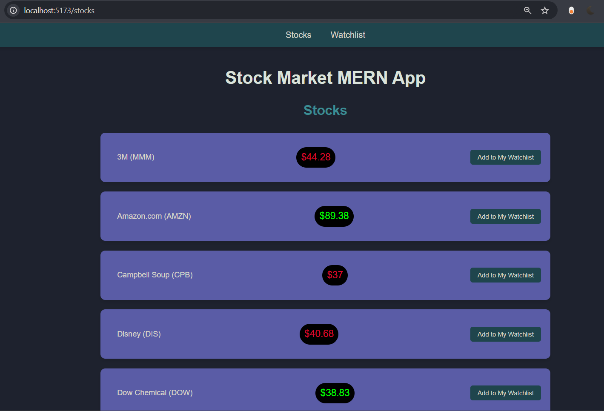
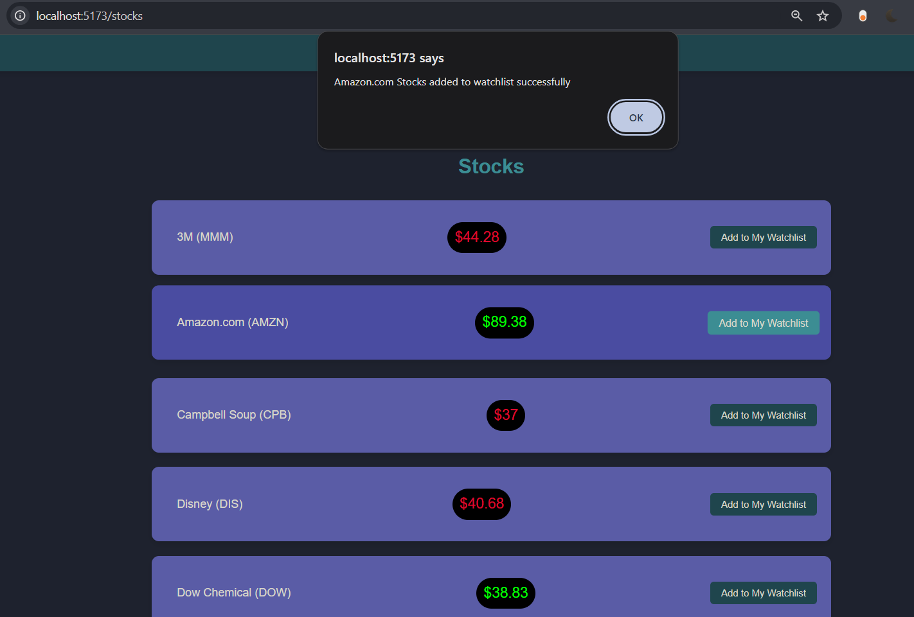
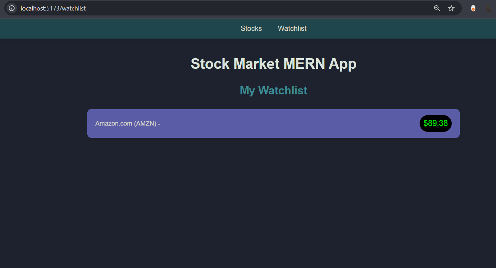

# Stock Market MERN App

Welcome to the Stock Market MERN App! This application allows users to view stock market data and manage their own watchlist. Built using the MERN (MongoDB, Express, React, Node.js) stack, this app showcases a simple yet powerful example of a full-stack web application.

## Some Screenshots :
1. Stocks Page:-

2. Alert Box:- 

3. Watchlist Page:-

## How It Works

1. **Fetching Stock Data**: The app fetches stock data from a backend API and displays it on the Stocks page.
2. **Adding to Watchlist**: Users can add stocks to their watchlist by clicking the "Add to My Watchlist" button.
3. **Storing Watchlist**: In the database there will be a list of stocks data which will be fetched by the server.

## Tech Stack

- **Frontend**: React
- **Backend**: Node.js, Express
- **Database**: MongoDB
- **HTTP Client**: Axios
- **Routing**: React Router

## About

The Stock Market MERN App has the following functionalities:

### Stocks Page
- **View Stocks**: Displays a list of stocks with their company names, symbols, and initial prices.
- **Add to Watchlist**: Allows users to add stocks to their personal watchlist.

### Watchlist Page
- **View Watchlist**: Shows the stocks that the user has added to their watchlist.

### Color Indication
- **Stock Prices**: Stock prices are displayed in random colors (Red or Green) to simulate price changes.

